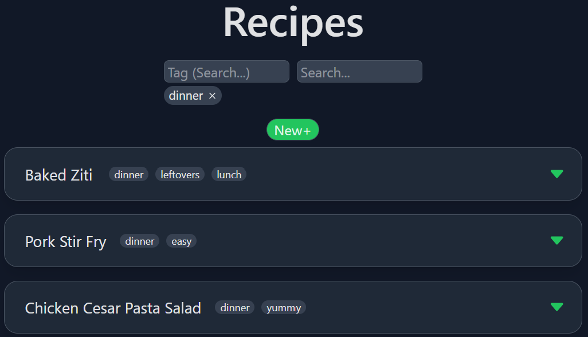

# RecipeMan
### A full-stack web application for storing recipes and shopping lists

## Project Description
RecipeMan was created as a free service for storing recipes and creating shopping lists from them. It features the ability to sort and tag recipes, create custom ingredients, units, and tags, and easily add to a shopping list directly from a recipe. The sleek UI works well for both desktop and mobile users, allowing for easy access while away from the computer, such as when cooking in the kitchen or out shopping.
## Usage
To use RecipeMan, visit the site [here](https://recipeman.onrender.com/) and create an account. Emails are collected for sign-in purposes and account recovery purposes only. After signing in, use the recipes page to create and view recipes, and use the lists page to create and view shopping lists.

*View of the recipes page populated with sample recipes*

*View of a sample shopping list*

From there, the ingredients for a recipe can be added to a shopping list with just a few buttons!
Multiple instances of the same ingredient on a recipe or list will automatically be merged together (provided their unit types are compatible) to make it easier to keep track of how much is needed.

Ingredient quantities of a recipe can easily be scaled up while viewing, and surrounding numbers in the instructions of a recipe with {{double brackets}} enables scaling for them as well 

## Technologies Used
RecipeMan uses the PERN stack, with the frontend and API hosted on Render and the database stored on Supabase. The API follows RESTful design paradigms, and uses Supabase's authentication services along with built-in authorization protocols to ensure user data security. The database, backend, and frontend were all designed from the ground up with the goals of this project in mind.

## Future Work
Additional features such as sharing recipes or lists between accounts could be added to enhance the user experience.
More advanced potential features would be the ability to retreive recipes automatically from website links, or the ability to scan physical recipe cards and have them imported.
